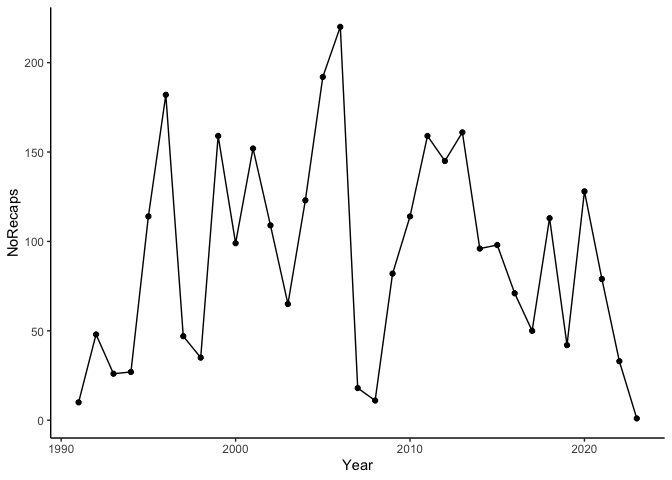
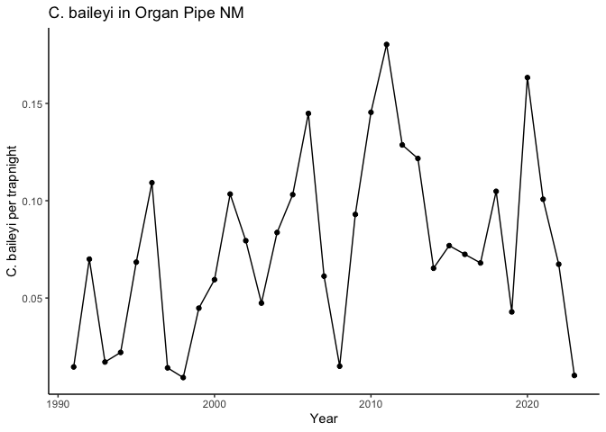

# Data Exploration
Ellen Bledsoe
2025-02-25

## Data Exploration

First, load packages

``` r
library(tidyverse)
```

### Read in Data Files

Explore the 4 CSV files from the Access Database.

``` r
# List all CSV files in the folder
csv_files <- list.files("../data/", pattern = "\\.csv$", full.names = TRUE)

# Loop through each file
for (file in csv_files) {
  # Extract the filename without the .csv extension
  file_name <- tools::file_path_sans_ext(basename(file))
  
  # Read the CSV file and assign it to a variable with the extracted name
  assign(file_name, read_csv(file), envir = .GlobalEnv)
}
```

### Data Wrangling

First, get only data from *C. baileyi*. Combine tables to get survey
information and dates with the records on individual rodents.

``` r
# get only C. baileyi records
baileyi <- left_join(RodentDetail, tluRodentSpecies, 
                     join_by(RodentSpeciesID == ID)) |> 
  filter(SpeciesCode == "CHBA")

# get survey dates and sites with the baileys data
baileyi_surveys <- full_join(baileyi, RodentSurvey,
                             join_by(RodentSurveyID == ID)) |> 
  mutate(StartDate = ymd(StartDate),
         EndDate = ymd(EndDate)) |> 
  select(ID, RodentSurveyID, Recapture, SiteID:Quadrat)
baileyi_surveys
```

    # A tibble: 4,287 × 7
           ID RodentSurveyID Recapture SiteID StartDate  EndDate    Quadrat
        <dbl>          <dbl>     <dbl>  <dbl> <date>     <date>       <dbl>
     1 144852             18         0     10 1992-06-30 1992-07-01       2
     2 144858             18         0     10 1992-06-30 1992-07-01       2
     3 144875             17         0     10 1992-06-30 1992-07-01       1
     4 144879             17         0     10 1992-06-30 1992-07-01       1
     5 144889             17         0     10 1992-06-30 1992-07-01       1
     6 144890             17         0     10 1992-06-30 1992-07-01       1
     7 144892             17         0     10 1992-06-30 1992-07-01       1
     8 144898             18         0     10 1992-06-30 1992-07-01       2
     9 144900             18         0     10 1992-06-30 1992-07-01       2
    10 144901             18         0     10 1992-06-30 1992-07-01       2
    # ℹ 4,277 more rows

Summarize the survey data by year

``` r
survey_by_year <- RodentSurvey |> 
  mutate(StartDate = ymd(StartDate),
         EndDate = ymd(EndDate),
         Year = year(EndDate),
         Nights = EndDate - StartDate)

trapnights_by_year <- survey_by_year |> 
  mutate(TrapNights = NumTraps * Nights) |> 
  group_by(Year) |> 
  summarise(TrapNights = as.numeric(sum(TrapNights))) 

trapnights_by_year
```

    # A tibble: 33 × 2
        Year TrapNights
       <dbl>      <dbl>
     1  1991        686
     2  1992        686
     3  1993       1519
     4  1994       1225
     5  1995       1666
     6  1996       1666
     7  1997       3332
     8  1998       3835
     9  1999       3550
    10  2000       1666
    # ℹ 23 more rows

Determine the number of *C. baileyi* caught per year

``` r
baileyi_year <- baileyi_surveys |> 
  mutate(Year = year(EndDate)) |> 
  group_by(Year) |> 
  summarise(Recaps = n(),
            NoRecaps = sum(Recapture == 0, na.rm = TRUE))

baileyi_year
```

    # A tibble: 33 × 3
        Year Recaps NoRecaps
       <dbl>  <int>    <int>
     1  1991     21       10
     2  1992     65       48
     3  1993     47       26
     4  1994     41       27
     5  1995    151      114
     6  1996    223      182
     7  1997     87       47
     8  1998     71       35
     9  1999    280      159
    10  2000    162       99
    # ℹ 23 more rows

Calculate *C. bailyei* per trapnight per year

``` r
baileyi_trapnight <- inner_join(baileyi_year, trapnights_by_year,
                                join_by(Year)) |> 
  mutate(CHBA_TrapNight = Recaps / TrapNights,
         CHBA_TrapNight_NoRecaps = NoRecaps / TrapNights)

baileyi_trapnight
```

    # A tibble: 33 × 6
        Year Recaps NoRecaps TrapNights CHBA_TrapNight CHBA_TrapNight_NoRecaps
       <dbl>  <int>    <int>      <dbl>          <dbl>                   <dbl>
     1  1991     21       10        686         0.0306                 0.0146 
     2  1992     65       48        686         0.0948                 0.0700 
     3  1993     47       26       1519         0.0309                 0.0171 
     4  1994     41       27       1225         0.0335                 0.0220 
     5  1995    151      114       1666         0.0906                 0.0684 
     6  1996    223      182       1666         0.134                  0.109  
     7  1997     87       47       3332         0.0261                 0.0141 
     8  1998     71       35       3835         0.0185                 0.00913
     9  1999    280      159       3550         0.0789                 0.0448 
    10  2000    162       99       1666         0.0972                 0.0594 
    # ℹ 23 more rows

### Plot *C. baileyi* Numbers

Plots for number with and without including recaptures give similar
results, so let’s stick with no recaptures included

#### *C. baileyi* individuals per year

``` r
ggplot(baileyi_trapnight, aes(Year, NoRecaps)) +
  geom_point() +
  geom_line() +
  theme_classic()
```



#### *C. baileyi* individuals per trap night

``` r
ggplot(baileyi_trapnight, aes(Year, CHBA_TrapNight_NoRecaps)) +
  geom_point() +
  geom_line() +
  theme_classic()
```


